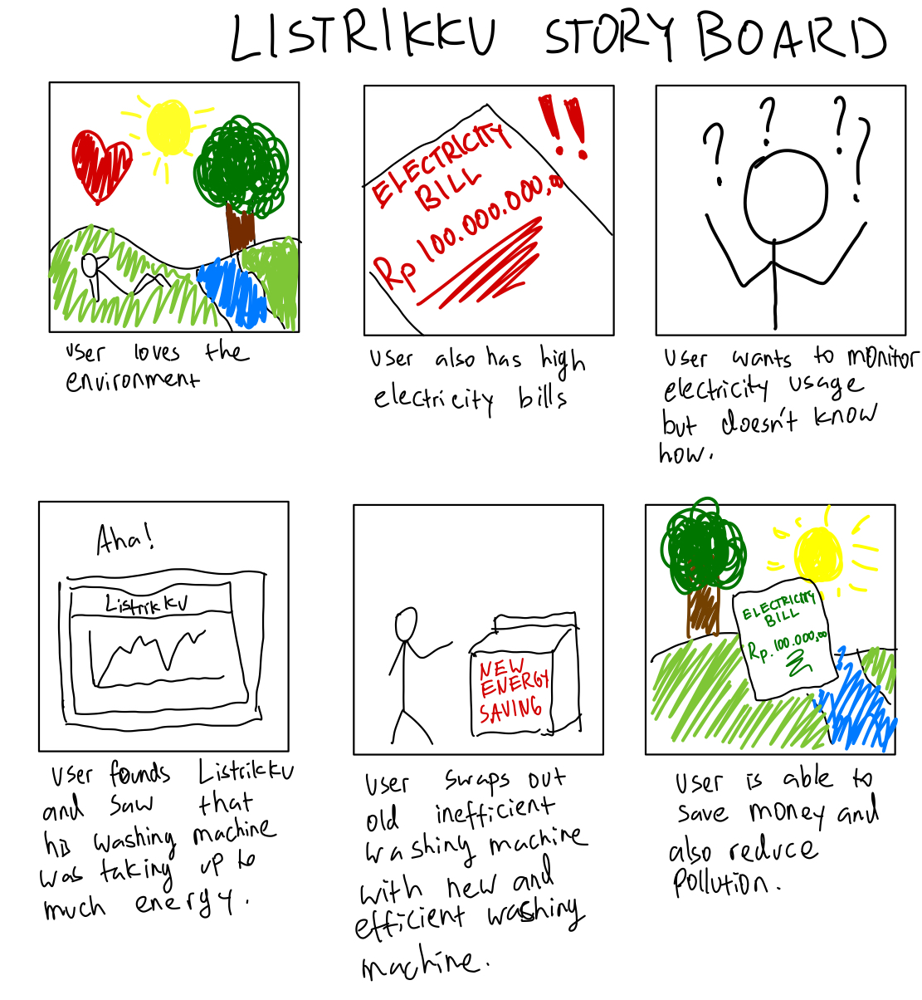
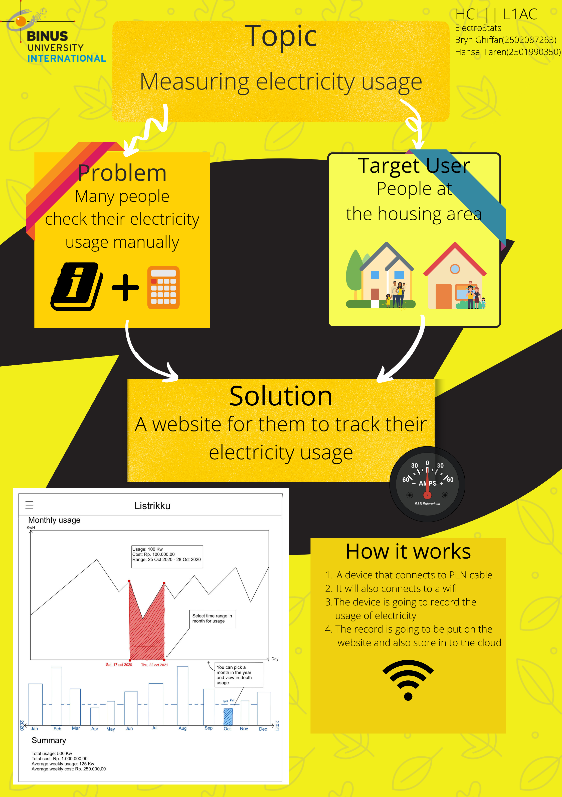

# Listrikku

**Live Link: https://brynghiffar.github.io/FPElectroStats_Listrikku/**

**Course:** Human Interaction (COMP6800001) - Final Project

**Class:** L1AC

**Team:** ElectroStats

**Members:**

* Bryn Ghiffar - 2502087263
* Hansel Ferren - 2501990350

## Description

The application is intended to measure the electricity usages of the user and provide them insightful statistics regarding their usage.

## Features

* Measure electricity usage
* Provide electricity usage statistics
* provides tips on how to lower electricity usage

## Storyboard

## Test case

## Logo's

## Poster

