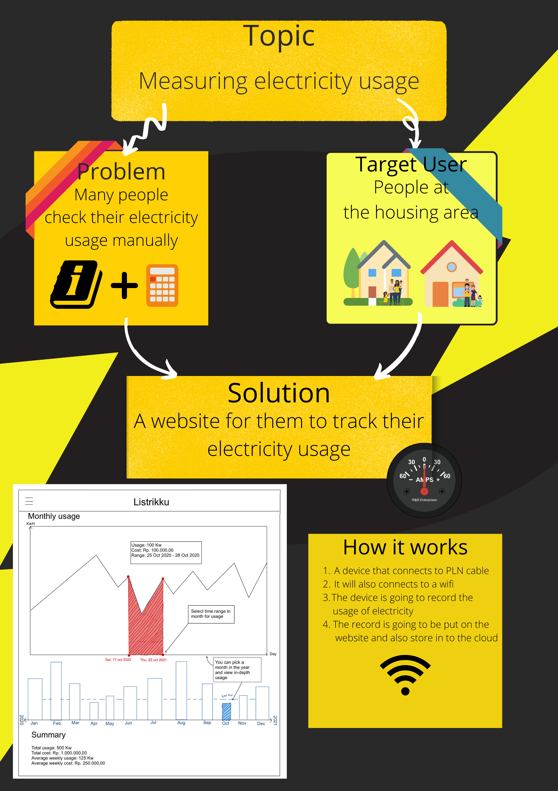

# Listrikku

**Live Link:**

**Course:** Human Interaction (COMP6800001) - Final Project

**Class:** L1AC

**Team:** ElectroStats

**Members:**

* Bryn Ghiffar - 2502087263
* Hansel Ferren - 2501990350

### Description

The application is intended to measure the electricity usages of the user and provide them insightful statistics regarding their usage.

### Features

* Measure electricity usage
* Provide electricity usage statistics

### Extra Information

### Logo's

### Poster

